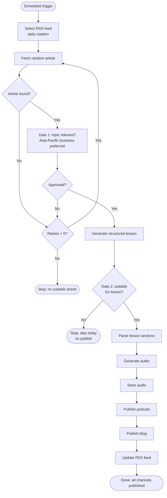

# Process Design: EcoEnglish Daily Content Pipeline

This document describes the **business process** behind [EcoEnglish Learning](../README.md): how daily English listening content is produced, where decisions occur, and how the process was improved after go-live.

Technical setup: [README](../README.md).

---

## Business context

| Item | Description |
|---|---|
| **Problem** | Producing one daily English lesson (audio + blog + podcast) manually takes several hours: select news, write materials, record audio, publish to multiple channels. |
| **Goal** | Run a repeatable daily workflow with minimal manual touchpoints while keeping quality gates (topic relevance, lesson structure). |
| **Output** | One podcast episode, one WordPress lesson page, audio file on S3, RSS update. |
| **Audience** | Japanese intermediate learners (B1–B2); content focus: Asia-Pacific business news. |
| **Trigger** | Scheduled Lambda execution (AWS EventBridge — configured outside this repository). |
| **Scope** | Daily content production and publishing. Out of scope: marketing, listener growth, manual editorial review. |

---

## AS-IS process (manual)

Before automation, the workflow looked like this:

```
1. Browse news sites / RSS feeds manually
2. Pick one economically relevant story
3. Write a learner-friendly script (~400 words)
4. Create vocabulary, quizzes, grammar notes, Japanese commentary
5. Record or generate audio
6. Upload audio to podcast host
7. Format and publish blog post with embedded player
8. Update podcast RSS / metadata
```

**Pain points**

- High manual effort every day
- Inconsistent format and difficulty level
- Multiple handoffs between writing, audio, and publishing tools
- No standard exception handling (e.g. “no suitable story today”)

---

## AS-IS vs TO-BE

| Dimension | AS-IS (manual) | TO-BE (automated) |
|---|---|---|
| **Executor** | Operator, every step | System on schedule; operator only for setup and changes |
| **Steps per day** | 8 separate manual tasks | One trigger runs the full chain |
| **Quality checks** | Judgment-based, variable | Two automated gates (topic filter + lesson suitability) |
| **Retries** | Operator picks another story ad hoc | Up to 5 automated re-selection attempts |
| **Exceptions** | No defined rule | Skip day or fail with a clear outcome |
| **Cross-channel output** | Format and labels varied | Fixed lesson template and unified branding |
| **Daily operator time** | Several hours (estimate) | None for routine runs |

---

## TO-BE process (automated)

The automated process runs as a **single orchestrated pipeline** in AWS Lambda. One scheduled run executes all stages sequentially.



**Systems involved:** RSS (Nikkei Asia / BBC Business) → OpenAI → S3 → Spreaker → WordPress.

Spreaker upload includes token refresh and encoding wait if the API requires it — details in [README](../README.md).

---

## Business rules

Rules that govern the daily content process:

1. **Input rotation** — One RSS source per day, alternating Nikkei Asia and BBC Business.
2. **Article selection** — Random entry from the day’s feed; must have at least a headline (summary preferred; headline-only feeds are supported).
3. **Gate 1 — Topic relevance** — Story must be economically or socially significant, with preference for Asia-Pacific business (markets, trade, tech, policy).
4. **Retry** — If Gate 1 fails or no article is found, select again — maximum **5 attempts** per run.
5. **Gate 2 — Lesson suitability** — Generated content must pass lesson rules (e.g. not celebrity gossip); otherwise the run stops without publishing.
6. **Publish sequence** — Audio stored → podcast episode created → blog post published (with audio embed) → RSS updated.
7. **Output consistency** — All channels use the same lesson structure and **Asia Business English (B1–B2)** positioning.

---

## Roles and manual touchpoints

| Activity | Automated / manual | When |
|---|---|---|
| Daily content run (select → publish) | Automated | Every scheduled trigger |
| Code deployment | Manual | Developer runs GitHub Action after code changes |
| Lambda environment variables | Manual | Initial setup and credential rotation |
| EventBridge schedule | Manual | Initial setup |
| Spreaker show metadata | Manual | Branding or positioning changes |

Routine daily production requires **no operator action**.

---

## Process outcomes

What each end state means for the business process:

| Outcome | Meaning | Operator action |
|---|---|---|
| **Success** | Podcast, blog, and RSS are updated for that day | None |
| **Skip** | No suitable topic for a lesson; nothing published that day | None (expected path) |
| **Failure** | No article passed selection after 5 attempts | Check logs / feeds if recurring |

---

## Success criteria

The process is considered working when:

- Scheduled runs complete end-to-end **without daily manual intervention**
- Each published lesson follows the **same structure** (script, vocabulary, quizzes, grammar, Japanese commentary)
- Input and rule changes (RSS narrowing, Asia-Pacific focus) **reduced off-topic outputs** compared to the initial automated version

Structured KPIs and step-level logging are not implemented yet. Adding timestamps per stage would be the next step toward measurable process analysis.

---

## Process improvements

Changes made after the initial automated pipeline was running. Each item describes the **original shape**, what **changed**, and **why**.

### RSS source selection

| | Detail |
|---|---|
| **Before** | Four feeds on daily rotation: BBC Business, NPR Business, Al Jazeera (all topics), ABC Australia (general news). Broad geographic coverage, but many entries were not business-focused. |
| **After** | Two feeds: **Nikkei Asia** and **BBC Business**. General-news sources removed. |
| **Why** | Off-topic stories triggered more classifier retries and produced lessons that did not match the “Asia business English” positioning. Narrower inputs → more consistent process output. |

### Article ingestion (Nikkei feed)

| | Detail |
|---|---|
| **Before** | Article selection only accepted RSS entries with a `summary` field. |
| **After** | Falls back to description, content, or **headline** when summary is missing. |
| **Why** | Nikkei Asia’s feed often ships title + link only. On Nikkei rotation days the selection step returned zero candidates even though headlines were available — a silent failure in the ingest step. |

### Topic classification and lesson generation rules

| | Detail |
|---|---|
| **Before** | Classifier asked whether a story was “economically or socially significant” with no regional focus. Lesson prompt used the same generic significance rule. |
| **After** | Classifier and generator both prefer **Asia-Pacific business** (markets, trade, tech, policy). |
| **Why** | The generic rule accepted globally significant but off-brand stories (e.g. US-only politics, non-business items from general-news feeds). Tightening the rule at both gateways aligns content with audience and reduces rework. |

### Channel copy and branding

| | Detail |
|---|---|
| **Before** | Mixed Japanese/English labels per channel. Spreaker: `{title}（Intermediate レベル）` + Japanese description. WordPress: `英語ニュース教材：{title}（Intermediate レベル）`. RSS feed title: `英語で学ぶ経済ニュース`; author: `Summary Samurai`. |
| **After** | Single positioning line across Spreaker, WordPress, and RSS: **Asia Business English (B1–B2)** with English descriptions pointing to the same blog URL. RSS feed title: `Econenglish — Asia Business English (B1–B2)`. |
| **Why** | Inconsistent labels made the output look like unrelated products across channels. Unified copy makes the handoff from podcast → blog clearer and keeps process output structurally the same everywhere. |

### Podcast distribution subprocess (Podbean → Spreaker)

| | Detail |
|---|---|
| **Before** | Audio uploaded and episodes published via Podbean API (client-credentials flow). |
| **After** | Spreaker API with OAuth2; access tokens refreshed automatically when expired; encoding status polled before using stream URL. |
| **Why** | Changed podcast host; subprocess redesigned to handle long-lived credentials and async encoding — a separate handoff step with its own exception paths, without changing the upstream content-generation flow. |

---

## Related documentation

- [README](../README.md) — Setup, deployment, and environment variables
- Entry point: `main.handler` in [`main.py`](../main.py)
