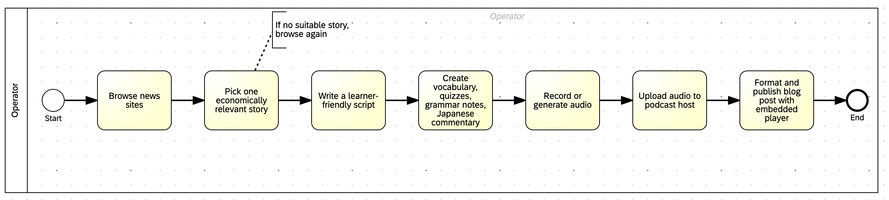
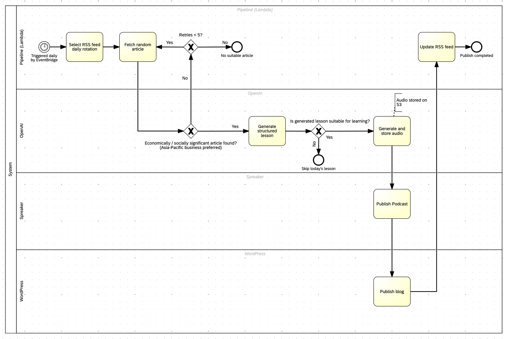

# Process Design: EcoEnglish Daily Content Pipeline

This document describes the **process model** behind [EcoEnglish Learning](../README.md): a reference manual baseline, the automated process that was designed and built, and refinements made after the system went live.

**Framing note:** This project is **not** a documented improvement of an existing business operation the author was running manually. It started as a personal idea — *“a system like this would be useful”* — and was implemented from scratch. The manual flow below is a **reference baseline** (what the work would look like without automation). The automated flow is the **implemented TO-BE**.

Technical setup: [README](../README.md).

---

## Business context


| Item            | Description                                                                                                                                              |
| --------------- | -------------------------------------------------------------------------------------------------------------------------------------------------------- |
| **Need**        | Daily English listening lessons (podcast + blog + study materials) on Asia-Pacific business news, aimed at Japanese intermediate learners (CEFR: B1–B2). |
| **Design goal** | A repeatable daily workflow with quality gates and no routine manual steps.                                                                              |
| **Output**      | One podcast episode, one WordPress lesson page, audio file on S3, RSS update.                                                                            |
| **Trigger**     | Scheduled Lambda execution (AWS EventBridge — configured outside this repository).                                                                       |
| **Scope**       | Daily content production and publishing. Out of scope: marketing, listener growth, manual editorial review.                                              |


---

## Reference process (manual baseline)

If this workflow were done by hand each day, it would look like this. **This baseline was not operated manually in practice** — it models the work the automated system replaces.

```
1. Browse news sites
2. Pick one economically relevant story
3. Write a learner-friendly script (~400 words)
4. Create vocabulary, quizzes, grammar notes, Japanese commentary
5. Record or generate audio
6. Upload audio to podcast host
7. Format and publish blog post with embedded player
```

**Reference process (BPMN)**


**Inherent limitations of a manual approach**

- High effort every day for a single operator
- Inconsistent format and difficulty level
- Multiple handoffs between writing, audio, and publishing tools
- No standard exception handling (e.g. “no suitable story today”)

This baseline is useful for comparing **designed automation** against **unaided human execution**, not for claiming a prior manual operation was redesigned.

---

## Baseline vs implemented process


| Dimension                | Reference (manual baseline)            | Implemented (automated)                                  |
| ------------------------ | -------------------------------------- | -------------------------------------------------------- |
| **Executor**             | Hypothetical operator, every step      | System on schedule; developer only for setup and changes |
| **Steps per day**        | 7 separate manual tasks                | One trigger runs the full chain                          |
| **Quality checks**       | Judgment-based, variable               | Two automated gates (topic filter + lesson suitability)  |
| **Retries**              | Ad hoc (“pick another story”)          | Up to 5 automated re-selection attempts                  |
| **Exceptions**           | No defined rule                        | Skip day or fail with a clear outcome                    |
| **Cross-channel output** | Likely inconsistent without a template | Fixed lesson template and unified branding               |
| **Daily operator time**  | Several hours (estimate)               | None for routine runs                                    |


---

## Implemented process (automated TO-BE)

The built system runs as a **single orchestrated pipeline** in AWS Lambda. One scheduled run executes all stages sequentially.

**Implemented process (BPMN)**


**Systems involved:** RSS (Nikkei Asia / CNA Business / CNBC Asia) → OpenAI → S3 → Spreaker → WordPress.

Spreaker upload includes token refresh and encoding wait if the API requires it — details in [README](../README.md).

Steps such as **RSS update on S3** exist in the automated process but were not part of the manual baseline (the podcast host handles its own feed when publishing manually).

---

## Business rules

Rules designed for the automated daily process:

1. **Input rotation** — One RSS source per day, rotating Nikkei Asia, CNA Business, and CNBC Asia.
2. **Article selection** — Random entry from the day’s feed; must have at least a headline (summary preferred; headline-only feeds are supported).
3. **Gate 1 — Economically / socially significant** (Asia-Pacific business preferred) — Story must pass this check before lesson generation (markets, trade, tech, policy).
4. **Retry** — If Gate 1 fails or no article is found, select again — maximum **5 attempts** per run.
5. **Gate 2 — Suitable for learning** — Generated lesson must pass content rules (e.g. not celebrity gossip); otherwise the run stops without publishing (`SKIP`).
6. **Publish sequence** — Audio stored → podcast episode created → blog post published (with audio embed) → RSS updated.
7. **Output consistency** — All channels use the same lesson structure and **Asia Business English (B1–B2)** positioning.

---

## Roles and manual touchpoints


| Activity                             | Automated / manual | When                                            |
| ------------------------------------ | ------------------ | ----------------------------------------------- |
| Daily content run (select → publish) | Automated          | Every scheduled trigger                         |
| Code deployment                      | Manual             | Developer runs GitHub Action after code changes |
| Lambda environment variables         | Manual             | Initial setup and credential rotation           |
| EventBridge schedule                 | Manual             | Initial setup                                   |
| Spreaker show metadata               | Manual             | Branding or positioning changes                 |


Routine daily production requires **no operator action**.

---

## Process outcomes

What each end state means for the automated process:


| Outcome     | Meaning                                                    | Action                          |
| ----------- | ---------------------------------------------------------- | ------------------------------- |
| **Success** | Podcast, blog, and RSS are updated for that day            | None                            |
| **Skip**    | No suitable topic for a lesson; nothing published that day | None (expected path)            |
| **Failure** | No article passed selection after 5 attempts               | Check logs / feeds if recurring |


---

## Success criteria

The implemented process is considered working when:

- Scheduled runs complete end-to-end **without daily manual intervention**
- Each published lesson follows the **same structure** (script, vocabulary, quizzes, grammar, Japanese commentary)
- Iterations after the first version (RSS narrowing, Asia-Pacific focus) **improved output consistency** compared to the initial build

Structured KPIs and step-level logging are not implemented yet. Adding timestamps per stage would be the next step toward measurable process analysis.

---

## Iterations after initial build

Changes made **after the first working version** of the automated pipeline — not improvements to a prior manual operation. Each item describes the **earlier version**, what **changed**, and **why**.

### RSS source selection


|                     | Detail                                                                                                                                                                         |
| ------------------- | ------------------------------------------------------------------------------------------------------------------------------------------------------------------------------ |
| **Earlier version** | Four feeds on daily rotation: BBC Business, NPR Business, Al Jazeera (all topics), ABC Australia (general news). Broad coverage, but many entries were not business-focused.   |
| **Current**         | Three feeds: **Nikkei Asia**, **CNA Business**, and **CNBC Asia**. BBC Business removed in favour of Asia-Pacific sources.                                                      |
| **Why**             | Off-topic stories triggered more classifier retries and produced lessons that did not match the “Asia business English” positioning. Narrower inputs → more consistent output. |


### Article ingestion (Nikkei feed)


|                     | Detail                                                                                                                                                                                            |
| ------------------- | ------------------------------------------------------------------------------------------------------------------------------------------------------------------------------------------------- |
| **Earlier version** | Article selection only accepted RSS entries with a `summary` field.                                                                                                                               |
| **Current**         | Falls back to description, content, or **headline** when summary is missing.                                                                                                                      |
| **Why**             | Nikkei Asia’s feed often ships title + link only. On Nikkei rotation days the selection step returned zero candidates even though headlines were available — a silent failure in the ingest step. |


### Topic classification and lesson generation rules


|                     | Detail                                                                                                                                                           |
| ------------------- | ---------------------------------------------------------------------------------------------------------------------------------------------------------------- |
| **Earlier version** | Classifier asked whether a story was “economically or socially significant” with no regional focus. Lesson prompt used the same generic rule.                    |
| **Current**         | Classifier and generator both prefer **Asia-Pacific business** (markets, trade, tech, policy).                                                                   |
| **Why**             | The generic rule accepted globally significant but off-brand stories. Tightening the rule at both gateways aligns content with audience and reduces wasted runs. |


### Channel copy and branding


|                     | Detail                                                                                                                                                                                   |
| ------------------- | ---------------------------------------------------------------------------------------------------------------------------------------------------------------------------------------- |
| **Earlier version** | Mixed Japanese/English labels per channel. Spreaker: `{title}（Intermediate レベル）` + Japanese description. WordPress: `英語ニュース教材：{title}（Intermediate レベル）`. RSS feed title: `英語で学ぶ経済ニュース`. |
| **Current**         | Single positioning line across Spreaker, WordPress, and RSS: **Asia Business English (B1–B2)** with English descriptions pointing to the same blog URL.                                  |
| **Why**             | Inconsistent labels made channels look unrelated. Unified copy clarifies the handoff from podcast → blog.                                                                                |


### Podcast distribution subprocess (Podbean → Spreaker)


|                     | Detail                                                                                                                                           |
| ------------------- | ------------------------------------------------------------------------------------------------------------------------------------------------ |
| **Earlier version** | Audio uploaded and episodes published via Podbean API (client-credentials flow).                                                                 |
| **Current**         | Spreaker API with OAuth2; access tokens refreshed automatically when expired; encoding status polled before using stream URL.                    |
| **Why**             | Changed podcast host; subprocess redesigned for long-lived credentials and async encoding without changing the upstream content-generation flow. |


---

## Related documentation

- [README](../README.md) — Setup, deployment, and environment variables
- Entry point: `main.handler` in `[main.py](../main.py)`

